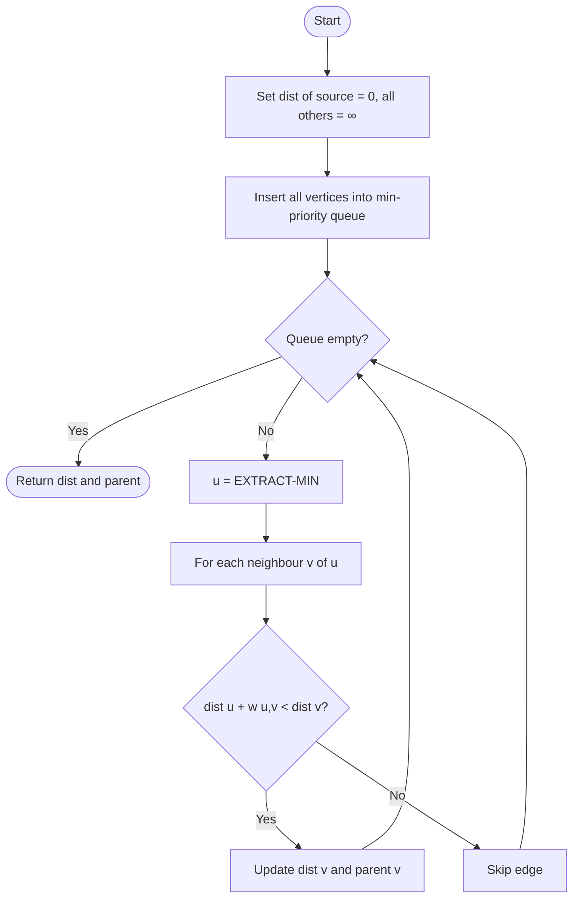
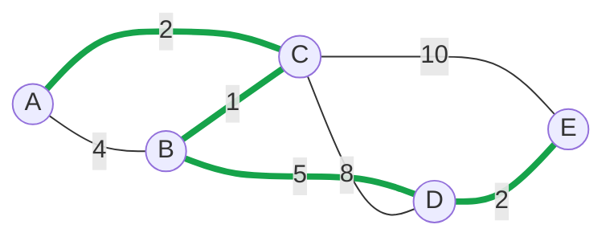

# Dijkstra's Algorithm: Finding Shortest Paths with a Greedy Strategy

*A DAA blog on single-source shortest paths (Greedy paradigm)*

---

## 1. Introduction

Every time a maps app finds the fastest route, or a network router decides where to forward a packet, a **shortest-path problem** is being solved. Given a weighted graph, we want the minimum-cost path from a **source** vertex to every other vertex.

**Dijkstra's algorithm** (Edsger W. Dijkstra, 1956) solves this for graphs with **non-negative edge weights**. It belongs to the **Greedy** design paradigm: at every step it permanently finalizes the closest unvisited vertex.

## 2. Core Idea

Maintain a tentative distance `dist[v]` for every vertex, initially ∞ (0 for the source). Repeatedly:

1. Pick the unvisited vertex `u` with the smallest `dist[u]`.
2. Mark `u` as finalized.
3. **Relax** every edge `(u, v)`: if `dist[u] + w(u,v) < dist[v]`, update `dist[v]` and record `parent[v] = u`.

**Why greedy works:** all weights are ≥ 0, so any other route to `u` must pass through a vertex at least as far away. It cannot be shorter than the current smallest tentative distance, so once `u` is picked its distance is final.

### Algorithm flow



## 3. Pseudocode

```text
DIJKSTRA(G, w, s):
    for each vertex v in G.V:
        dist[v]   ← ∞
        parent[v] ← NIL
    dist[s] ← 0
    Q ← priority queue of all vertices keyed by dist

    while Q is not empty:
        u ← EXTRACT-MIN(Q)
        for each neighbour v of u:
            if dist[u] + w(u, v) < dist[v]:     // relaxation
                dist[v]   ← dist[u] + w(u, v)
                parent[v] ← u
                DECREASE-KEY(Q, v, dist[v])
    return dist, parent
```

## 4. Worked Example

Consider this undirected weighted graph (source = **A**). Green edges show the final shortest path to **E**.



**Edges:** A–B (4), A–C (2), B–C (1), B–D (5), C–D (8), C–E (10), D–E (2).

### Step-by-step trace

Each row shows distances *after* processing the picked vertex.

| Step | Picked (finalized) | dist[A] | dist[B] | dist[C] | dist[D] | dist[E] |
|------|--------------------|---------|---------|---------|---------|---------|
| Init | none | **0** | ∞ | ∞ | ∞ | ∞ |
| 1 | A (0) | 0 | 4 | 2 | ∞ | ∞ |
| 2 | C (2) | 0 | **3** (via C) | 2 | 10 | 12 |
| 3 | B (3) | 0 | 3 | 2 | **8** (via B) | 12 |
| 4 | D (8) | 0 | 3 | 2 | 8 | **10** (via D) |
| 5 | E (10) | 0 | 3 | 2 | 8 | 10 |

**Key observations**

- In step 2, B improves from 4 to 3 because A→C→B (2 + 1) beats A→B directly.
- In step 3, D improves from 10 to 8 via B.
- In step 4, E improves from 12 to 10 via D.

**Final shortest distances from A:** B = 3, C = 2, D = 8, E = 10

**Shortest path to E:** A → C → B → D → E (2 + 1 + 5 + 2 = 10), recovered by following `parent[]` backwards.

## 5. Implementation (Python, binary heap)

```python
import heapq

def dijkstra(graph, source):
    dist = {v: float('inf') for v in graph}
    parent = {v: None for v in graph}
    dist[source] = 0
    pq = [(0, source)]                      # (distance, vertex)

    while pq:
        d, u = heapq.heappop(pq)
        if d > dist[u]:                     # stale entry, skip
            continue
        for v, w in graph[u]:
            if d + w < dist[v]:             # relaxation
                dist[v] = d + w
                parent[v] = u
                heapq.heappush(pq, (dist[v], v))
    return dist, parent

graph = {
    'A': [('B', 4), ('C', 2)],
    'B': [('A', 4), ('C', 1), ('D', 5)],
    'C': [('A', 2), ('B', 1), ('D', 8), ('E', 10)],
    'D': [('B', 5), ('C', 8), ('E', 2)],
    'E': [('C', 10), ('D', 2)],
}
print(dijkstra(graph, 'A')[0])
# {'A': 0, 'B': 3, 'C': 2, 'D': 8, 'E': 10}
```

## 6. Complexity Analysis

| Priority queue implementation | Time complexity | Best for |
|---|---|---|
| Unsorted array | **O(V²)** | Dense graphs |
| Binary min-heap | **O((V + E) log V)** | Sparse graphs (most common) |
| Fibonacci heap | **O(E + V log V)** | Theoretical best |

**Why O((V + E) log V) with a heap:** each vertex is extracted once (V × log V), and each edge triggers at most one relaxation with a heap update (E × log V).

**Space complexity:** **O(V + E)** for the adjacency list, plus O(V) for `dist`, `parent` and the queue.

## 7. Limitations and Comparison

- **Fails with negative edge weights**, because the greedy finalization assumption breaks. Use **Bellman-Ford** (O(VE)) instead.
- For all-pairs shortest paths, use **Floyd-Warshall** (O(V³)).
- On unweighted graphs, plain **BFS** is enough (O(V + E)).

| Algorithm | Handles negative weights | Problem type | Time |
|---|---|---|---|
| Dijkstra | No | Single-source | O((V + E) log V) |
| Bellman-Ford | Yes | Single-source | O(VE) |
| Floyd-Warshall | Yes (no negative cycles) | All-pairs | O(V³) |
| BFS | Unweighted only | Single-source | O(V + E) |

## 8. Applications

GPS and route navigation, OSPF routing in networks, flight itinerary planning, game AI pathfinding (A* is Dijkstra plus a heuristic), and social network "degrees of separation".

## 9. Conclusion

Dijkstra's algorithm is a textbook demonstration of the greedy strategy: making the locally optimal choice (closest unvisited vertex) yields a globally optimal solution, provided edge weights are non-negative. With a binary heap it runs in O((V + E) log V) and is the backbone of many real-world routing systems.

## References

1. Cormen, Leiserson, Rivest, Stein, *Introduction to Algorithms*, 4th ed., MIT Press, Ch. 22.
2. Dijkstra, E. W. (1959). "A note on two problems in connexion with graphs." *Numerische Mathematik*, 1, 269–271.
3. Levitin, A., *Introduction to the Design and Analysis of Algorithms*, Pearson.
